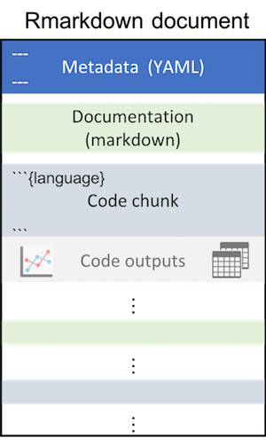

```{r setup, include=FALSE}
knitr::opts_chunk$set(echo = TRUE)
```

## Reproducible Analysis with Rmarkdown

### Why making out work reproducible

### How can R markdown help

### Show the gallery

https://rmarkdown.rstudio.com/gallery.html

### Demo time

- Create a RStudio Project names `ASM18_DataViz`
- Create Firmarkdown

### Intro Slides

- How Rmarkdown (and friends) can help
  - Combine code and documentation in **one** document/file: literate programming
  - Help to compile compelling documents (reports, journal articles, presentations, ...)
  - Easy to share through various formats (websites, blogs, dashboards, interactive visualizations)
  - Can even let you run other scripting languages (Python, SQL, ...)

- What is Rmarkdown
  - Markdown is a simple (read easy to use) text-based markup for creating easy to read documents to be converted to HTML, PDF, docx and other formats. Document styles can be customised with HTML/CSS and math notation can be included using LaTeX or mathjax. (From: [RopenSci reproducibility guide](http://ropensci.github.io/reproducibility-guide/sections/tools/))
  - There are 3 basic components of an R Markdown document: 
     - metadata   (`YAML` Ain't Markup Language)
     - text for documentation   (`markdown` + other few tricks)
     - code (chunks) storing your anlaysis   (`R` and friends)
     
      
  
  - the **R** flavor
    - R Markdown: An enhanced flavor of Markdown that recognizes R code chunks, which allows the embedding of R directly into a Markdown document to create dynamic and reproducible documents. (From: [RopenSci reproducibility guide](http://ropensci.github.io/reproducibility-guide/sections/tools/))


  
- What can you do with Rmarkdown
  - Document extensively your analysis
  - Share results (figures and tables)
  - Let others execute and modify your code
  - Create interactive documents
  - Create websites and blog
  - Write journal articles and Books
  
- What Rmarkdown can not help you with
  - Data management and access
  - Capture your computing environment
  - Modularize your code


### Rmarkdown tips and tricks

- chunk options : https://bookdown.org/yihui/rmarkdown/r-code.html

- Global options: 
  - `knitr::opts_chunk$set(dev = "png")`
  - reference figures/tables using `bookdown::pdf2`

### Hands on exercise

- Use data from LTER
  Potentially: https://nceas.github.io/metajam/articles/dataset-batch-processing.html
- show a compelling data analysis with it
- open the floor to cool data visualizations for the ggplot2 part of the training


## References

### General

- Interactive `markdown` tutorial: https://www.markdowntutorial.com
- RStudio Material on Rmarkdown : https://rmarkdown.rstudio.com/articles.html
- RStudio Gallery: https://rmarkdown.rstudio.com/gallery.html
- Rmarkdown cheat sheet: https://www.rstudio.com/wp-content/uploads/2016/03/rmarkdown-cheatsheet-2.0.pdf
- Rmarkdown the Definitive Guide [Xie et al,2018]: https://www.rstudio.com/wp-content/uploads/2015/03/rmarkdown-reference.pdf
- GitHub Intro to Markdown: https://guides.github.com/features/mastering-markdown/
- knitr - chunk options: https://yihui.name/knitr/options/
- knitr in a nutshell: http://kbroman.org/knitr_knutshell/
- Making R Markdonw even easier: https://thinkr-open.github.io/remedy/
- Report automation: https://rviews.rstudio.com/2017/11/07/automating-summary-of-surveys-with-rmarkdown/


### Advanced formatting

- Image parameters: https://www.zevross.com/blog/2017/06/19/tips-and-tricks-for-working-with-images-and-figures-in-r-markdown-documents/
- Fancy Table formatting with `kableExtra`: https://cran.r-project.org/web/packages/kableExtra/vignettes/awesome_table_in_html.html#overview
- Interactive tables with `DT`: https://rstudio.github.io/DT/


### Adding References and Biliography

- RStudio Bibliography page: https://rmarkdown.rstudio.com/authoring_bibliographies_and_citations.html
- Easy citations in RMarkdown with RefManageR from [tclavL](https://tclavelle.github.io/): https://tclavelle.github.io/blog/reference_tips/


### Data Viz

- https://socviz.co/index.html


### Others

- Mail merge: https://rmarkdown.rstudio.com/articles_mail_merge.html 
