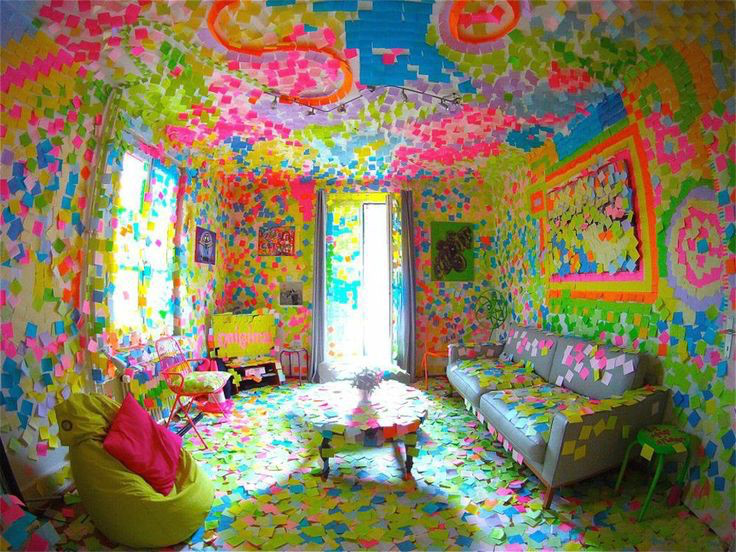
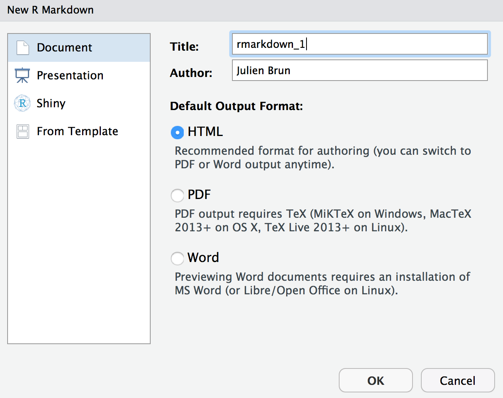
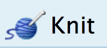
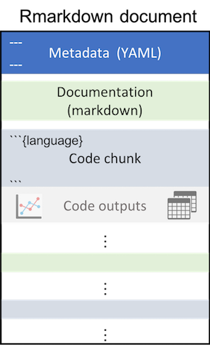
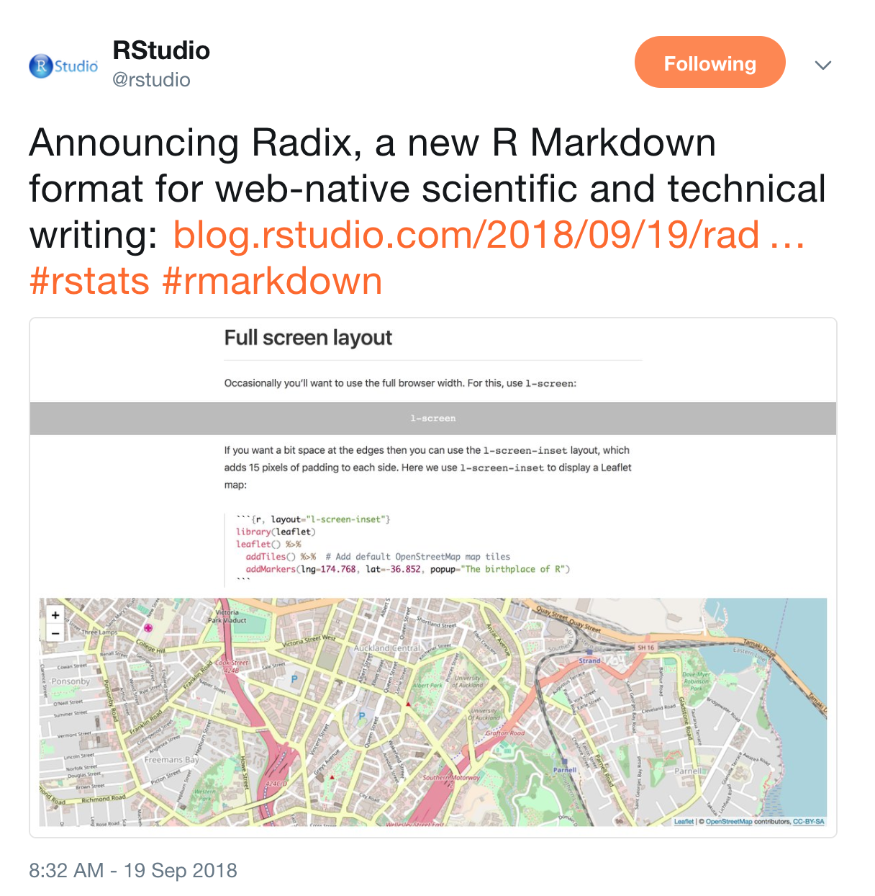
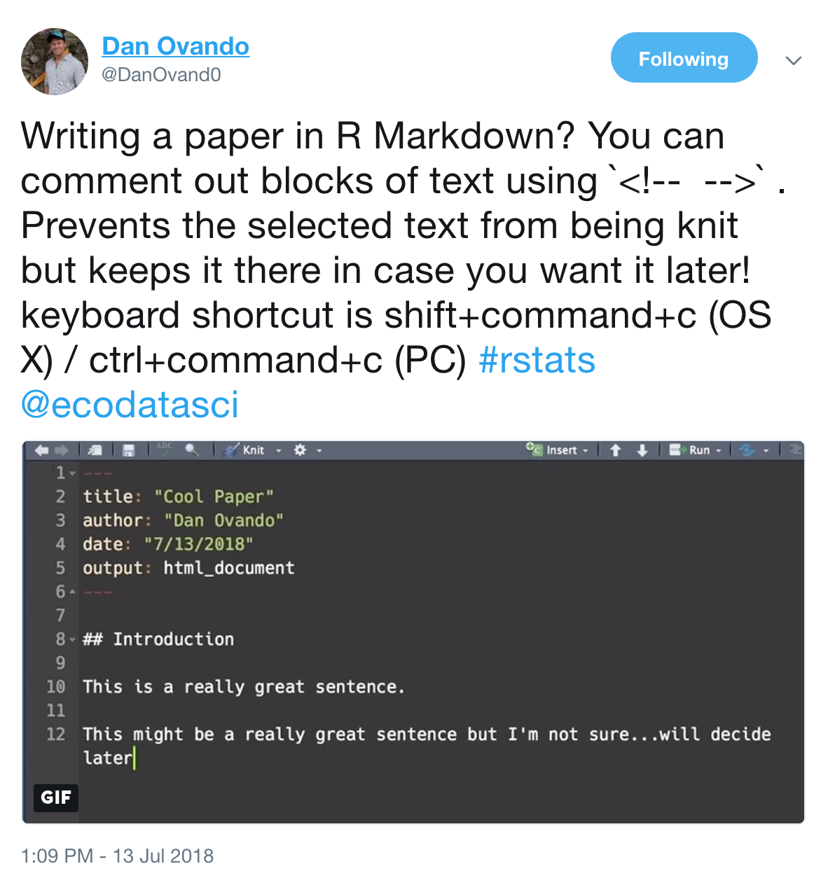

```{r setup, include=FALSE}
options(htmltools.dir.version = FALSE)
```


background-image: url(https://lternet.edu/wp-content/uploads/2018/02/LTER-network-horizontal.png)
background-position: center
background-size: contain 
class: center
## _please close your laptop_
---


# Brainstorming

.xlarge[
- What is _Reproducible Science_ and why should we care?

- How do you use _data visualization_ ?

- What could we do to make our scientific workflow more reproducible ?
]

---

# Workshop 

.xlarge[
- Please speak up: **questions**,  **own tips**!!

- Use your **sticky notes** to tell us _how you are doing_
]

--

.xlarge[
- Keep it fun!

]


---
background-image: url(images/hex-rmarkdown.png)
background-position: center
background-size: contain

---
class: inverse, center, middle

# Let's do it !!

## _please open your laptop_

---

# Workshop material

.xlarge[
http://bit.ly/ASM18_DataViz


1. Unzip the archive

2. Create a RStudio project
]

---

### Create our First R Markdown Document

- From `Rstudio` create a new R Markdown document:  
`File -> New File -> R Markdown`

- Keep the default options and fill up the `Title` and `Author` fields

.center[]

.footnote[
_Note: In this workshop we will use the [RStudio IDE](https://www.rstudio.com/products/rstudio/), but you do not have to !_
]

---

# Create our First R Markdown Document

.xlarge[

- Click the `Knit` button to render the document
]
<br>

.center[]

<br>

.large[Note: you could also enter this command at the R console:  `rmarkdown::render("rmkdown1.Rmd")`
]

---
class: inverse, center, middle

# How does this work ?!

---

## R Markdown Document Structure



.pull-left[
.large[
3 basic components 
  - **Metadata**  
  _(`YAML` Ain't Markup Language)_
  
  - **Text** for documentation  
  _(`markdown` + other few tricks)_
  
  - **Code (chunks)** with your analysis 
  _(`R` and friends)_
]
]

---


# Markdown

.large[
`Markdown` is a simple (read easy to use) **text-based markup** for creating easy to read documents to be converted to `HTML`, `PDF`, `docx` and other formats. 

Document styles can be customized with `HTML/CSS` and math notation can be included using `LaTeX` or `mathjax`.
]

--
.large[
```
$\bar{X}=\frac{1}{n}\sum_{i=1}^nX_i$
```
$$\bar{X}=\frac{1}{n}\sum_{i=1}^nX_i$$
]

<br>

.footnote[
_From: [RopenSci reproducibility guide](http://ropensci.github.io/reproducibility-guide/sections/tools/)_
]

---

## the **R** flavor

.large[
`R Markdown`: An _enhanced_ flavor of `Markdown` that recognizes _**`R` code chunks**_, which allows the embedding of R directly into a Markdown document to create dynamic and reproducible documents. 
]
<br>
<br>
<br>
<br>
<br>
<br>

.footnote[
_From: [RopenSci reproducibility guide](http://ropensci.github.io/reproducibility-guide/sections/tools/)_
]

---
background-image: url(images/markdown-how-it-works.png)
background-position: center
background-size: contain

# How is it rendered ?


---

# Chunk options - What to show 

- **eval**: if `eval = FALSE` code chunk will not be evaluated when knitted 

- **warning**, **message**, and **error**: will hide warnings, messages, and errors in the output document when set to `FALSE`.   
Note that these messages will be shown in the R console

- **include**: When `include = FALSE`, this whole code chunk is excluded in the output document  
Note: equivalent of `echo = FALSE`, `results = 'hide'`, `warning = FALSE`, and `message = FALSE`

- **echo**: Whether to echo the source code in the output document (useful to hide code generating plots)

- **results**: When set to 'hide', text output will be hidden; when set to 'asis', text output is written “as-is” with no rendering

---

# Chunk options - Figures 

- **fig.width** and **fig.height**: The (graphical device) size of R plots in inches. R plots in code chunks are first recorded via a graphical device in knitr, and then written out to files. 

- **out.width** and **out.height**: The output size of R plots in the output document. These options may scale images. You can use percentages, e.g., out.width = '80%' means 80% of the page width.

- **fig.align**: The alignment of plots. It can be 'left', 'center', or 'right'.

- **dev**: The graphical device to record R plots. Typically it is 'pdf' for LaTeX output, and 'png' for HTML output, but you can certainly use other devices, such as 'svg' or 'jpeg'.

- **fig.cap**: The figure caption


---
class: inverse, center, middle


---
class: center, middle

# Exploratory Data Visualization

---
class: center, middle

# Why visualize data?

# The Datasaurus Dozen


---
class: bottom
background-image: url(images/datasaurus_table.png)
background-position: center
background-size: 100%


---
class: bottom
background-image: url(images/datasaurus_plots.png)
background-position: center
background-size: 80%


---
class: bottom

# What makes an effective graph?


Creating more effective graphs by Robbins `ggplot2` by Wickham


---
class: center, middle

.xlarge[`ggplot2`: A layered grammar of graphics]

---

# What is this?


---

## What is this? A coordinate system


---

## What is this? A coordinate system **AND** data and aesthetics


---

## What is this? A coordinate system, data and aesthetics **AND** geometric objects


---


## What is this? A coordinate system data and aesthetics and geometric objects **AND** scale


---

## What is this? A coordinate system data and aesthetics and geometric objects and scale **AND** statistical transformations


---

## What is this? A coordinate system data and aesthetics and geometric objects and scale and statistical transformations **AND** Faceting


---

# Format for this ggplot2 object

<br>


```{r ggplot2, eval=FALSE, tidy=FALSE}
ggplot(Data, aes(x=Var1, y=Var2)) + geom_point() + 
geom_smooth() +  
scale_x_log10() + scale_y_log10() +  
facet_wrap(~Group)
```


---
class: inverse, center, middle

## _please open your laptop and open the script:_ `ggplot2_intro.R`

---
class: inverse, center, middle

## Putting it back together

---


## Why R Markdown can help reproducibility

.large[
- Combine **code** and **documentation** in **one** document/file  
_=> Promote literate programming_

- Help to generate compelling documents  
_=> reports, journal articles, presentations, ..._

- Easy to **share** through various formats  
_websites, blogs, dashboards, interactive visualizations_

- Can even let you run other languages  
_Python, bash, SQL, ..._

- Plain text!
]

---


## What can you do with R Markdown ?

.large[
- Document extensively your analysis

- Share results (figures and tables)

- Let others execute and modify your code

- Create interactive documents

- Create websites and blogs

- Write journal articles and books
]

--
.large[
- Make presentations like this one!!
]

---

## R Markdown has a dynamic community !!




---
class: inverse, center, middle

# One more thing...

---

# Relative Paths

.large[

- RStudio Projects automatically set your working directory to the top / project folder

- When you knit a R Markdown document, the paths to external files (data, images, ...) are **relative to the document**

<br>
**_=> If you R Markdown document is in a sub-directory,  relative paths are different_**
]

.footnote[
.large[
_the [`here`](https://github.com/jennybc/here_here) package can help you with this!_ 
]
]

---
class: bottom
background-image: url(images/wd.png)
background-position: center
background-size: contain


.footnote[
_source: https://isteves.github.io/paris/rladies.html_
]

---
class: inverse, center, middle


## One step towards reproducibility...  
## but many other aspects of your workflow still to be considered !!


---

## Data

.large[
- (Files) management
- Format
- Access
- Preservation
]


--

## Software / Code 

.large[
- Script everything
- Use open source
- Track changes 
- Comment your code well
- Share your code 
]


